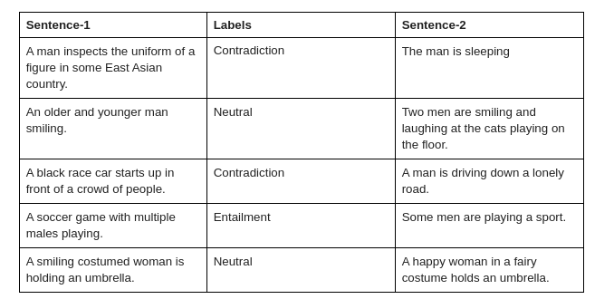

# Obective
The problem is for every given pair of sentences -- (sentence-1, sentence-2), we need to determine if sentence-2 can be logically inferred given sentence-1.

# Dataset

The dataset is a collection of human-written English sentence pairs manually labeled for balanced classification with the labels entailment, contradiction, and neutral. There are 9350 training and 494 testing sentence pairs.

# Approaches
    1. Multi class classification using a vanilla RNN model
    2. Fine tuning a BERT pre trained model for classification 
    
- This problem could be posed as a multi-class classification problem. 
- Given 2 sentences as input we need to find a softmax output of a number of classes(in out case 2 classes)
- Sentence entailment is a difficult problem to solve because the network needs to look at big sentences and understand their underlying relationship.
- Before starting with heavier models like BERT, I decided to check out the RNN performance in this problem first.
- Later I moved onto BERT models and fine tuned one pre trained model. BERT performance was obviously better than vanila RNN model 

# 1. Multi class classification using a vanilla RNN model
### Details:
- I have used a GRU architecture for the training
- Tested with bidirectional GRU with than one layer. Used pre trained glove embeddings for words 
- Check out the notebook link below, it has both training and testing code
- Notebook link -> https://github.com/trinanjan12/sentence_entailment/blob/master/sentence_entailment_using_vanila_rnn.ipynb

### Results:
- The model starts to overfit quite early even with dropout.
- val accuracy was quite low, around 50%

# 2. Fine Tuning a BERT pre trained model for classification 
### Details:
- Used the python transformer library to finetune a pretrained bert classification model
- First, tokenize the words using BertTokenizer(bert-base-uncased)(it has 30k words with an embedding dimension of 768)
- Load a BertForSequenceClassification model. This model has one linear layer at the top(bottleneck layer)
- Ideally, we should first freeze the base layers and only train the classification layer for one epoch
- After we can unfreeze all the layer and train the entire mode
- However in my experiment I didn't see much difference with the approach described above
- So, I ended up only training the classification layer(all the bert base layers were frozen)
- Check out the notebook link below, it has both training and testing code
- Notebook link -> https://github.com/trinanjan12/sentence_entailment/blob/master/finetune_bert_classifier.ipynb
- https://github.com/trinanjan12/sentence_entailment/blob/master/test_bert_classifier.ipynb

### Results:
- The val accuracy this time was around 80% after 5 epoch